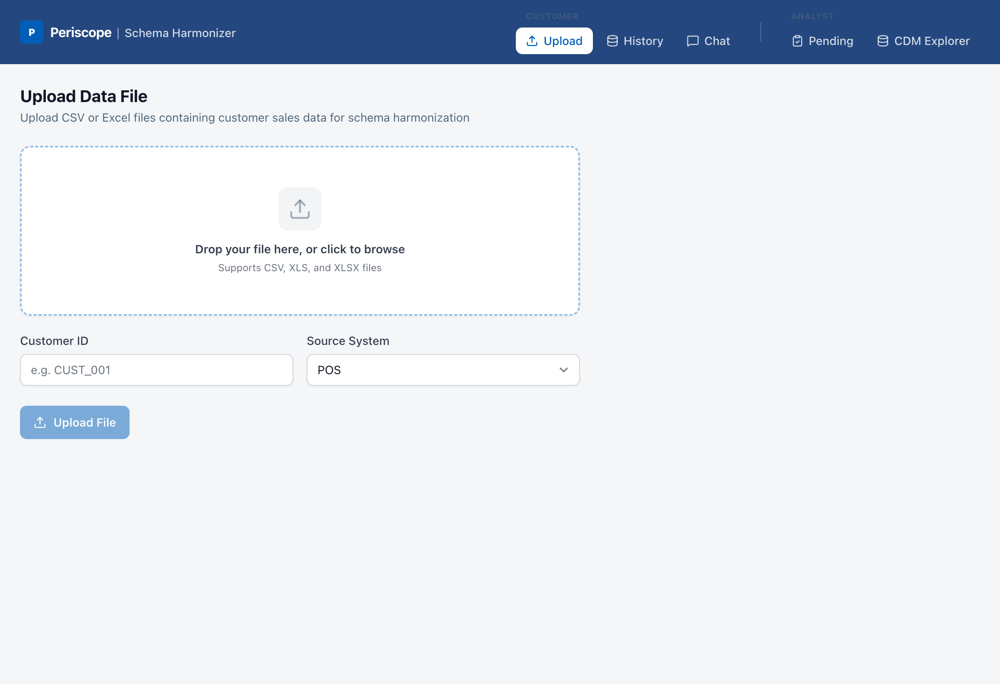
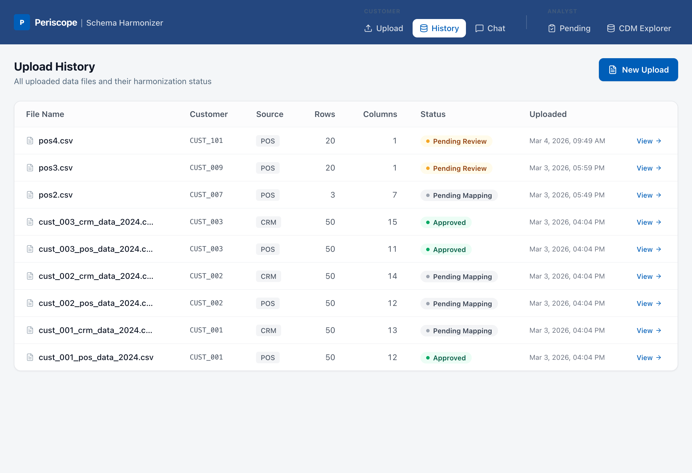
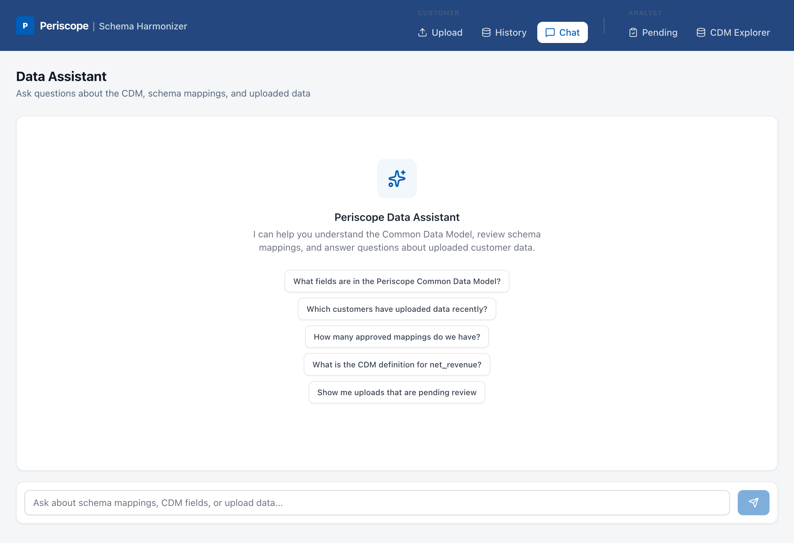
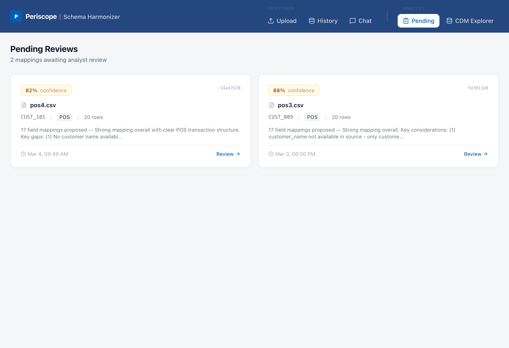
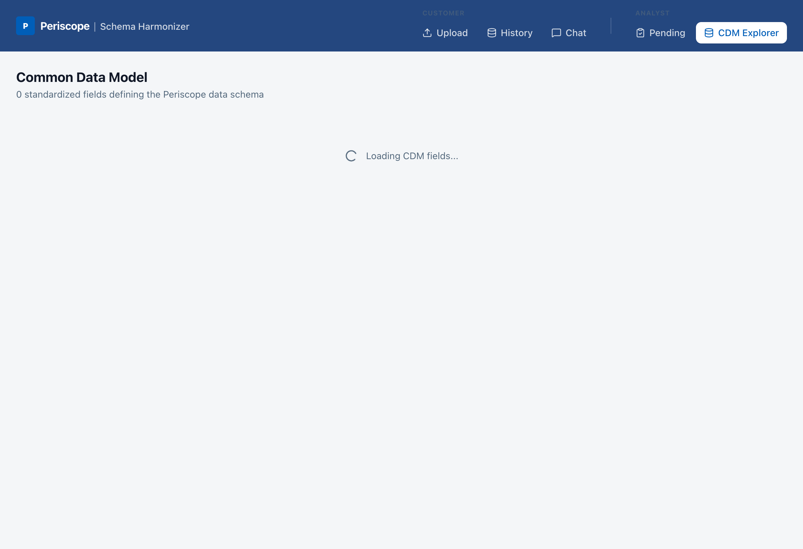

# Periscope Schema Harmonizer

> **AI-powered schema harmonization for Periscope** — maps customer sales data to a Common Data Model using LLM-based mapping, Vector Search, and a human-in-the-loop review workflow. Built as a full-stack Databricks App.

---

## Screenshots

| Customer Portal — Upload | Upload History |
|:---:|:---:|
|  |  |

| Data Assistant (Chat) | Analyst — Pending Reviews |
|:---:|:---:|
|  |  |

| CDM Explorer |
|:---:|
|  |

---

## Overview

The **Periscope GSM** platform helps consumer goods and retail companies analyze sales performance. A core challenge is that every customer brings a different data format — different column names, units, and structures for the same underlying sales data.

**Periscope Schema Harmonizer** solves this by:

1. **Accepting customer data uploads** (CSV/Excel) through a branded self-service portal
2. **Automatically mapping** the customer's schema to Periscope's Common Data Model (CDM) using Claude + Vector Search
3. **Routing proposed mappings** to a human analyst for review and approval
4. **Ingesting approved data** into the CDM Delta tables and updating the Vector Search index for future reuse

The result: faster customer onboarding, fewer manual mapping errors, and a continuously improving AI that learns from every approved mapping.

---

## Architecture

```
┌─────────────────────────────────────────────────────────────────┐
│              Periscope Schema Harmonizer                        │
│                  (Databricks App)                               │
├──────────────────────────┬──────────────────────────────────────┤
│  Customer Portal (React) │  Analyst Review Portal (React)       │
│  • File upload (CSV/XLS) │  • Side-by-side mapping review       │
│  • Upload history        │  • Approve / Edit / Reject           │
│  • Chat interface        │  • Confidence scores + reasoning      │
└──────────┬───────────────┴──────────────┬───────────────────────┘
           │          FastAPI / uvicorn   │
           └──────────────┬──────────────┘
                          │
         ┌────────────────┼────────────────────┐
         ▼                ▼                    ▼
┌──────────────┐  ┌───────────────────┐  ┌─────────────────────┐
│   Lakebase   │  │  Vector Search    │  │  Foundation Model   │
│ (PostgreSQL) │  │ (schema_mappings  │  │  Claude Sonnet 4.5  │
│              │  │      _index)      │  │                     │
│ • uploads    │  │                   │  │ • Schema mapping    │
│ • customers  │  │ Historical        │  │ • Chat / Q&A        │
│ • mappings   │  │ approved          │  │                     │
│ • reviews    │  │ mappings as       │  │ OpenAI-compatible   │
│              │  │ embeddings        │  │ endpoint            │
└──────────────┘  └───────────────────┘  └─────────────────────┘
         │
         ▼
┌─────────────────────────────────────────────────────────────┐
│              Unity Catalog — Delta Tables                   │
│                                                             │
│  periscope_harmonizer_catalog.periscope.cdm_schema          │
│  periscope_harmonizer_catalog.periscope.raw_uploads         │
│  periscope_harmonizer_catalog.periscope.ingested_sales      │
│  periscope_harmonizer_catalog.periscope.approved_mappings   │
└─────────────────────────────────────────────────────────────┘
```

---

## Use Cases

### UC1 — Customer Data Upload & Schema Extraction
Customers log into the Periscope portal and upload a CSV or Excel file containing sales data. The system parses up to 200 rows, extracts column names, infers data types, captures sample values, and stores metadata in Lakebase.

### UC2 — LLM-Powered Schema Mapping with Vector Search
The backend queries a **Vector Search index** for historically approved mappings from similar customer schemas (few-shot context), then calls **Claude Sonnet 4.5** to propose:
- `source_column` → `cdm_field` mapping
- Transformation expressions (e.g. `CAST(x AS DATE)`, `x / 100`)
- Confidence score (0–1) per field
- Reasoning explanation

### UC3 — Human Review & Approval Workflow
A Periscope analyst sees a side-by-side view of the proposed mapping with confidence scores. They can:
- **Approve** the full mapping as-is
- **Edit** individual field mappings before approving
- **Reject** with feedback notes

### UC4 — CDM Enhancement & Vector Search Update
Post-approval:
- Approved mapping is applied to ingest the customer's data into `ingested_sales` (CDM Delta table)
- Approved mapping is stored in Unity Catalog (`approved_mappings`) and re-indexed into Vector Search for future reuse
- New CDM fields introduced by the customer are proposed for CDM extension

### UC5 — Chat Interface
A conversational UI (streaming) allows users to ask natural language questions:
- *"What columns from this file map to revenue?"*
- *"Has this schema pattern been seen before?"*
- *"Show me the CDM definition for product_sku"*
- *"What transformations were applied to the Carrefour upload?"*

---

## Databricks Components

| Component | Usage |
|---|---|
| **Databricks Apps** | Hosts the full-stack app (React + FastAPI on uvicorn :8000). Single process serves both the API and static frontend. |
| **Lakebase (PostgreSQL)** | Transactional state management — uploads, customers, schema mappings, review decisions. OAuth token-based auth with auto pool refresh every 45 min. |
| **Vector Search** | Stores approved schema mappings as embeddings. Queried at mapping time to retrieve `num_results=3` similar historical mappings as few-shot context for the LLM. |
| **Foundation Model API** | Claude Sonnet 4.5 (`databricks-claude-sonnet-4-5`) via OpenAI-compatible endpoint. Used for schema mapping and chat. |
| **Unity Catalog (Delta)** | Persistent storage for CDM schema definition, raw upload metadata, post-approval ingested sales, and approved mapping history. |
| **Databricks SDK** | Dual-mode auth — uses CLI profile locally (`fe-vm-periscope-harmonizer`), auto-injects credentials in Databricks Apps via `DATABRICKS_APP_NAME` env detection. |
| **SQL Statement API** | Setup scripts use `WorkspaceClient` to run DDL against Unity Catalog via a serverless SQL warehouse. |

---

## Project Structure

```
periscope-schema-harmonizer/
│
├── app.py                          # FastAPI app factory, routes, static file serving
├── app.yaml                        # Databricks App config (command, env vars, port)
├── main.py                         # CLI entry point
├── requirements.txt                # Python dependencies
├── pyproject.toml                  # Project metadata (uv)
│
├── server/
│   ├── config.py                   # Dual-mode auth, env vars, workspace client
│   ├── db.py                       # Lakebase (asyncpg) pool with OAuth token refresh
│   ├── llm.py                      # OpenAI-compatible Foundation Model client
│   ├── uc.py                       # Unity Catalog SQL helpers
│   └── routes/
│       ├── upload.py               # POST /api/upload, GET /api/uploads
│       ├── mapping.py              # POST /api/map-schema (LLM + VS)
│       ├── reviews.py              # POST /api/approve, POST /api/reject
│       ├── cdm.py                  # GET /api/cdm (CDM field definitions)
│       └── chat.py                 # POST /api/chat (streaming)
│
├── frontend/
│   ├── src/
│   │   ├── App.tsx                 # Root component, routing
│   │   ├── pages/
│   │   │   ├── customer/           # Customer portal (upload, history, chat)
│   │   │   └── review/             # Analyst portal (pending reviews, CDM explorer)
│   │   ├── components/             # Shared UI components
│   │   ├── stores/                 # Zustand state stores
│   │   ├── api/client.ts           # API client
│   │   └── types/index.ts          # TypeScript type definitions
│   ├── package.json
│   └── vite.config.ts
│
├── docs/
│   ├── DEMO_SCRIPT.md              # Step-by-step demo walkthrough (~10 min)
│   ├── EMAIL_DRAFT.md              # Project summary email draft
│   └── screenshots/                # App screenshots (6 screens)
│
└── setup/
    ├── 01_create_uc_tables.py      # Create Unity Catalog Delta tables + seed CDM fields
    ├── 02_create_lakebase_tables.py # Create Lakebase PostgreSQL tables + seed customers
    ├── 03_generate_synthetic_data.py # Generate synthetic demo uploads
    └── 04_create_vs_index.py       # Create Vector Search index on approved_mappings
```

---

## Common Data Model (CDM)

The CDM defines Periscope's canonical schema for sales data. Every customer upload is mapped to these fields:

| CDM Field | Type | Required | Description |
|---|---|---|---|
| `date` | DATE | ✅ | Transaction date |
| `customer_id` | STRING | ✅ | Unique customer identifier |
| `customer_name` | STRING | | Customer display name |
| `product_sku` | STRING | ✅ | Product identifier |
| `product_name` | STRING | | Product display name |
| `product_category` | STRING | | Category / segment |
| `channel` | STRING | | Sales channel (POS, online, B2B) |
| `region` | STRING | | Geographic region |
| `units_sold` | INTEGER | ✅ | Volume sold |
| `revenue` | DECIMAL | ✅ | Gross revenue |
| `discount` | DECIMAL | | Discount applied |
| `net_revenue` | DECIMAL | | Revenue after discount |
| `cost` | DECIMAL | | Cost of goods sold |
| `margin` | DECIMAL | | Gross margin |
| `store_id` | STRING | | Store / location identifier |
| `rep_id` | STRING | | Sales rep identifier |
| `source_system` | STRING | | Origin system (POS / CRM / ERP) |

---

## API Reference

| Method | Path | Description |
|---|---|---|
| `GET` | `/api/health` | Health check |
| `POST` | `/api/upload` | Upload CSV/Excel, extract schema, store in Lakebase |
| `GET` | `/api/uploads` | List all uploads (filter by `customer_id`) |
| `GET` | `/api/uploads/{id}` | Get upload detail |
| `POST` | `/api/map-schema` | Trigger LLM mapping for an upload |
| `GET` | `/api/mappings` | List mappings (filter by `status`) |
| `GET` | `/api/mappings/{id}` | Get mapping detail |
| `POST` | `/api/approve` | Approve a mapping (with optional edits) |
| `POST` | `/api/reject` | Reject a mapping with feedback |
| `GET` | `/api/cdm` | Get CDM field definitions |
| `POST` | `/api/chat` | Chat with Liquidity Analyst (streaming) |

---

## Getting Started

### Prerequisites

- **Databricks workspace** with:
  - Serverless compute enabled
  - Unity Catalog enabled
  - Databricks Apps enabled
  - Lakebase (PostgreSQL) enabled
  - Vector Search enabled
  - Foundation Model API access (`databricks-claude-sonnet-4-5`)
- **Databricks CLI** installed and authenticated
- **Python 3.11+** and **uv** (or pip)
- **Node.js 18+** and **npm**

### 1. Authenticate with Databricks

```bash
databricks auth login --host https://<your-workspace>.azuredatabricks.net \
  --profile fe-vm-periscope-harmonizer
```

### 2. Clone the Repository

```bash
git clone https://github.com/prasannacs5/periscope-schema-harmonizer.git
cd periscope-schema-harmonizer
```

### 3. Install Python Dependencies

```bash
# Using uv (recommended)
uv sync

# Or using pip
pip install -r requirements.txt
```

### 4. Run Setup Scripts

Run these in order from the `setup/` directory. Each script connects to your Databricks workspace using the CLI profile.

**Step 1 — Create Unity Catalog Delta tables:**
```bash
uv run python setup/01_create_uc_tables.py
```
Creates `cdm_schema`, `raw_uploads`, `ingested_sales`, `approved_mappings` in `periscope_harmonizer_catalog.periscope` and seeds 17 CDM field definitions.

**Step 2 — Create Lakebase PostgreSQL tables:**
```bash
uv run python setup/02_create_lakebase_tables.py
```
Creates `customers`, `uploads`, `schema_mappings`, `mapping_reviews` tables in the Lakebase instance and seeds 3 demo customers (Carrefour, Unilever, Reckitt).

**Step 3 — Generate synthetic demo data:**
```bash
uv run python setup/03_generate_synthetic_data.py
```
Generates synthetic customer upload records and pre-approved mappings for demo purposes.

**Step 4 — Create Vector Search index:**
```bash
uv run python setup/04_create_vs_index.py
```
Creates and populates a Vector Search index on `approved_mappings` for few-shot schema matching.

> ⚠️ **Note:** Update `CATALOG`, `WAREHOUSE_ID`, `LAKEBASE_HOST`, and `PROFILE` at the top of each setup script to match your workspace.

### 5. Build the Frontend

```bash
cd frontend
npm install
npm run build
cd ..
```

This produces `frontend/dist/` which FastAPI serves as static files.

### 6. Run Locally

```bash
uv run uvicorn app:app --host 0.0.0.0 --port 8000 --reload
```

Open [http://localhost:8000](http://localhost:8000).

The backend auto-detects local vs. Databricks Apps environment:
- **Local**: uses the Databricks CLI profile `fe-vm-periscope-harmonizer`
- **Databricks Apps**: uses injected `DATABRICKS_TOKEN` / `DATABRICKS_HOST` env vars

---

## Deploying to Databricks Apps

### Option A — Deploy via CLI

```bash
databricks apps deploy periscope-harmonizer \
  --source-code-path /Workspace/Users/<you>/periscope-schema-harmonizer \
  --profile fe-vm-periscope-harmonizer
```

### Option B — Deploy via Workspace UI

1. Upload this project to your Databricks workspace (Workspace Files)
2. Navigate to **Apps** in the left sidebar
3. Click **Create App** → **Custom**
4. Point to the workspace path containing `app.yaml`
5. Configure environment variables (see below)

### Environment Variables (`app.yaml`)

| Variable | Description | Default |
|---|---|---|
| `SERVING_ENDPOINT` | Foundation Model endpoint name | `databricks-claude-sonnet-4-5` |
| `CATALOG` | Unity Catalog catalog name | `periscope_harmonizer_catalog` |
| `DB_SCHEMA` | Unity Catalog schema name | `periscope` |
| `VS_ENDPOINT` | Vector Search endpoint name | `periscope-vs-endpoint` |
| `PGHOST` | Lakebase host (auto-injected) | — |
| `PGPORT` | Lakebase port (auto-injected) | `5432` |
| `PGDATABASE` | Lakebase database name (auto-injected) | — |
| `PGUSER` | Lakebase user (auto-injected) | — |

> `PGHOST`, `PGPORT`, `PGDATABASE`, and `PGUSER` are **automatically injected** by Databricks when the Lakebase resource is attached to the app in `app.yaml` — do not set these manually.

---

## Configuration

All configuration lives in `server/config.py`. Key settings:

```python
PROFILE        = "fe-vm-periscope-harmonizer"   # Databricks CLI profile for local dev
WAREHOUSE_ID   = "dd322a5c9476d8cf"              # SQL warehouse for UC queries
CATALOG        = "periscope_harmonizer_catalog"  # Unity Catalog catalog
SCHEMA         = "periscope"                     # Unity Catalog schema
VS_ENDPOINT    = "periscope-vs-endpoint"         # Vector Search endpoint
VS_INDEX       = f"{CATALOG}.{SCHEMA}.schema_mappings_index"
LLM_MODEL      = "databricks-claude-sonnet-4-5" # Foundation Model serving endpoint
```

---

## Workspace

| Setting | Value |
|---|---|
| **Workspace** | FE-VM Serverless (`fe-vm-periscope-harmonizer`) |
| **Region** | `us-west-2` |
| **Catalog** | `periscope_harmonizer_catalog.periscope` |
| **Lakebase instance** | `instance-dcc73e40-6699-4763-b3bf-7ce975db83bb` |
| **LLM** | Claude Sonnet 4.5 via Databricks Foundation Model API |

---

## Tech Stack

| Layer | Technology |
|---|---|
| **Backend** | Python, FastAPI, uvicorn |
| **Frontend** | React, TypeScript, Vite, Tailwind CSS, Zustand |
| **Database** | Lakebase (PostgreSQL) via asyncpg |
| **AI** | Claude Sonnet 4.5 (Databricks Foundation Model API) |
| **Vector Store** | Databricks Vector Search |
| **Data Lake** | Unity Catalog (Delta Lake) |
| **Hosting** | Databricks Apps |
| **Auth** | Databricks OAuth (dual-mode: CLI profile / Apps token) |
| **Package Manager** | uv |

---

## Demo Customers (Pre-Seeded)

| Customer ID | Name | Industry |
|---|---|---|
| `CUST_001` | Carrefour SA | Retail |
| `CUST_002` | Unilever Global | FMCG |
| `CUST_003` | Reckitt Benckiser | Consumer Goods |

---

## Demo

A complete demo walkthrough is available in [`docs/DEMO_SCRIPT.md`](docs/DEMO_SCRIPT.md) (~10 minutes). It covers:

1. **The Problem** — why manual schema mapping doesn't scale
2. **Customer Upload** — file upload and schema extraction
3. **AI Mapping** — Vector Search + Claude Sonnet 4.5 in action
4. **Analyst Review** — human-in-the-loop approval workflow
5. **Chat Interface** — conversational Q&A about schemas and mappings
6. **CDM Explorer** — browsing the canonical data model
7. **Architecture Recap** — Databricks components summary

A project summary email draft is in [`docs/EMAIL_DRAFT.md`](docs/EMAIL_DRAFT.md).

---

## License

Internal demo. Built for Periscope GSM Practice on Databricks.
