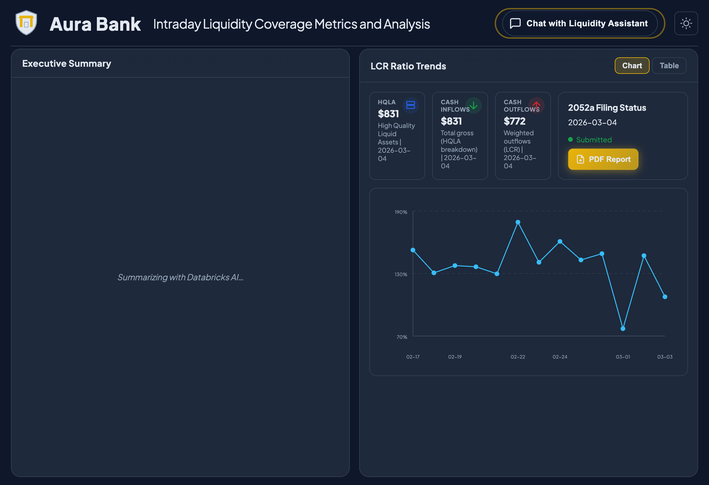

# Email Draft — Periscope Schema Harmonizer

**To:** [Recipients]
**Subject:** Periscope Schema Harmonizer — AI-Powered Customer Data Onboarding on Databricks

---

Hi team,

I wanted to share a demo we built for **McKinsey Periscope** (GSM Practice) — an AI-powered schema harmonization app that automates how customer sales data gets mapped to Periscope's Common Data Model.

## The Problem

Every Periscope customer brings sales data in a different format — different column names, units, and structures for the same underlying data. Today, mapping each customer's schema to the CDM is manual, error-prone, and takes days.

## What We Built

**Periscope Schema Harmonizer** is a full-stack Databricks App that:

1. **Accepts customer uploads** (CSV/Excel) through a branded self-service portal
2. **Automatically maps** schemas to the CDM using Claude Sonnet 4.5 + Vector Search for few-shot context
3. **Routes proposed mappings** to a human analyst for review and approval
4. **Ingests approved data** into CDM Delta tables and updates the Vector Search index — so each approval makes the next mapping smarter

## Architecture

```
Customer Portal (React)  ──►  FastAPI Backend  ──►  Lakebase (PostgreSQL)
Analyst Review Portal     │                    ──►  Vector Search (embeddings)
                          │                    ──►  Foundation Model API (Claude)
                          │                    ──►  Unity Catalog (Delta tables)
```

## Databricks Components

| Component | How It's Used |
|---|---|
| **Databricks Apps** | Hosts the full-stack app (React + FastAPI, single deployment) |
| **Lakebase** | Transactional state — uploads, customers, mappings, review decisions |
| **Vector Search** | Retrieves historically approved mappings as few-shot context for the LLM |
| **Foundation Model API** | Claude Sonnet 4.5 for schema mapping proposals + conversational chat |
| **Unity Catalog** | CDM schema definitions, raw uploads, ingested sales data, approved mappings |

## Screenshots

### Customer Portal — Upload & History
| Upload Page | Upload History |
|:---:|:---:|
|  |  |

### Chat & Analyst Review
| Data Assistant (Chat) | Analyst — Pending Reviews |
|:---:|:---:|
|  |  |

### Home & CDM Explorer
| Home | CDM Explorer |
|:---:|:---:|
|  |  |

## Key Takeaway

The flywheel effect is the differentiator: every approved mapping is indexed in Vector Search and used as few-shot context for future mappings. The more customers onboard, the smarter and faster the system gets.

Happy to walk through a live demo if helpful. The full code and demo script are in the repo.

Best,
Prasanna
